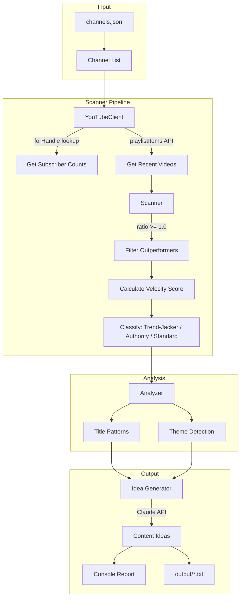

# YouTube Outperformance Scanner - Architecture

## Overview
Scans ~100+ YouTube channels daily to find videos where views exceed subscriber count, analyzes title/theme patterns, and generates content ideas for Overtime properties using Claude.

## System Diagram

## Stack
- Language: Python 3.11+
- YouTube API: google-api-python-client
- AI: Anthropic Claude API
- Config: python-dotenv
