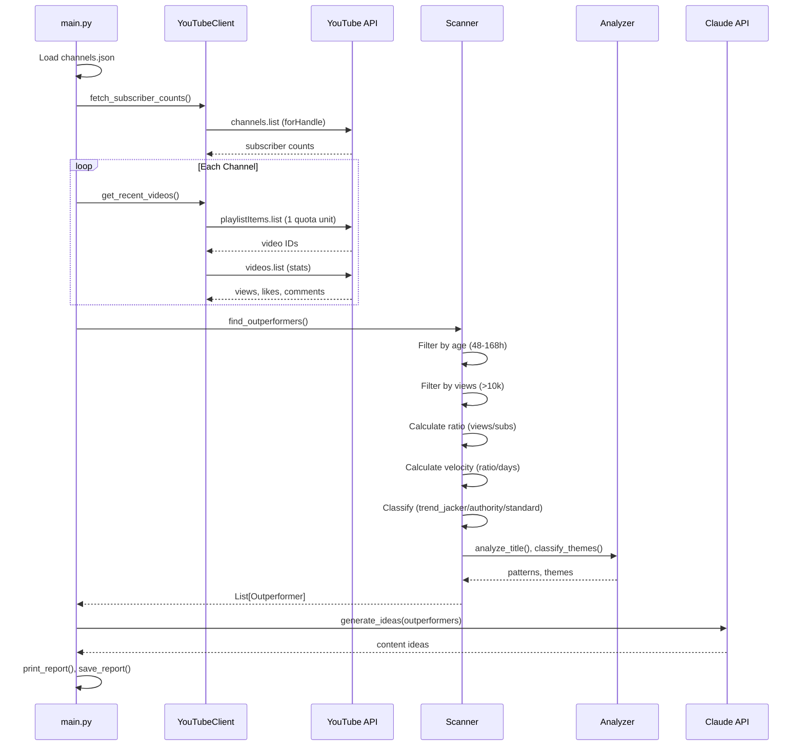
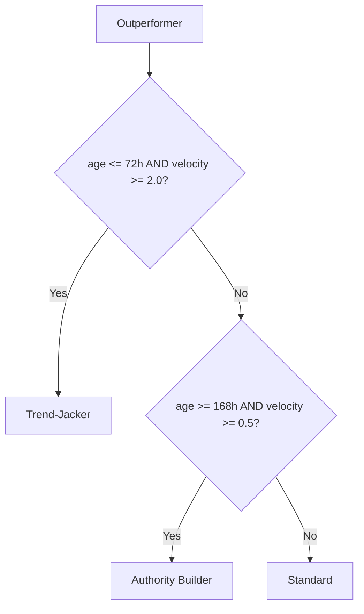

# Data Flow

## Main Scan Flow


## Velocity Score Formula
```
velocity_score = (views / subscribers) / days_since_posted
```

## Classification Logic


## Key Data Structures
```python
@dataclass
class Outperformer:
    video: Video
    channel: Channel
    ratio: float           # views / subscribers
    velocity_score: float  # ratio / days
    age_hours: float
    classification: str    # trend_jacker | authority_builder | standard
    title_patterns: list
    themes: list
```
